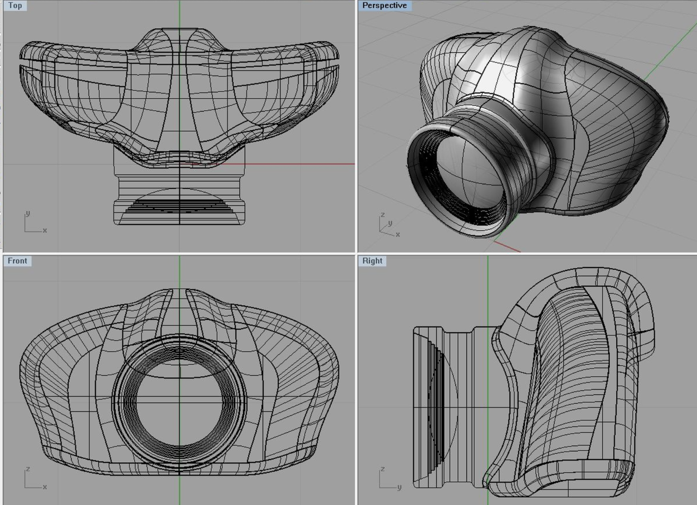

# Blok 3 – 3D grafika (Blender)

## Cíl

Cílem bylo vytvořit jednoduchou 3D scénu lyžařského střediska a seznámit se se základy práce v programu Blender. Zaměřil jsem se především na modelování objektů, práci s materiály a orientaci v 3D prostoru.

---

## Postup

Při tvorbě scény jsem začal modelováním terénu a postupně přidával další objekty, které tvoří lyžařské středisko. Používal jsem základní 3D tvary, které jsem upravoval v Edit Mode podle potřeby.

Po dokončení modelů jsem jednotlivým objektům přiřadil materiály, aby scéna působila přirozeněji. Nakonec jsem nastavil kameru a vytvořil výsledný render scény.

---

## Výstupy

* Soubor scény `lyzarske_stredisko.blend`
* Výsledný render:

---

## Reflexe

Největší problém pro mě představoval začátek práce v Blenderu, protože jsem se teprve seznamoval s ovládáním programu. Nejnáročnější částí bylo vytvoření hory a celkového terénu tak, aby působil přirozeně.

Během práce jsem si osvojil základní orientaci v Blenderu, práci s objekty, materiály a kamerou. Příště bych si scénu předem více naplánoval a věnoval více času finálnímu renderu a celkovému doladění detailů.

---

## Teoretické pozadí (stručně)

Blender je program určený pro tvorbu 3D grafiky. Objekty jsou tvořeny vrcholy, hranami a plochami, které dohromady vytvářejí tzv. mesh. V Edit Mode lze upravovat geometrii objektů, zatímco v Object Mode se pracuje s celými objekty. Materiály určují vzhled povrchu a renderování vytváří výsledný 2D obraz z připravené 3D scény. Podrobnější vysvětlení jednotlivých pojmů je uvedeno v souboru `teorie.md`.

---

## Zdroje

* https://docs.blender.org/
* https://www.youtube.com/@blenderguru
* https://polyhaven.com/
